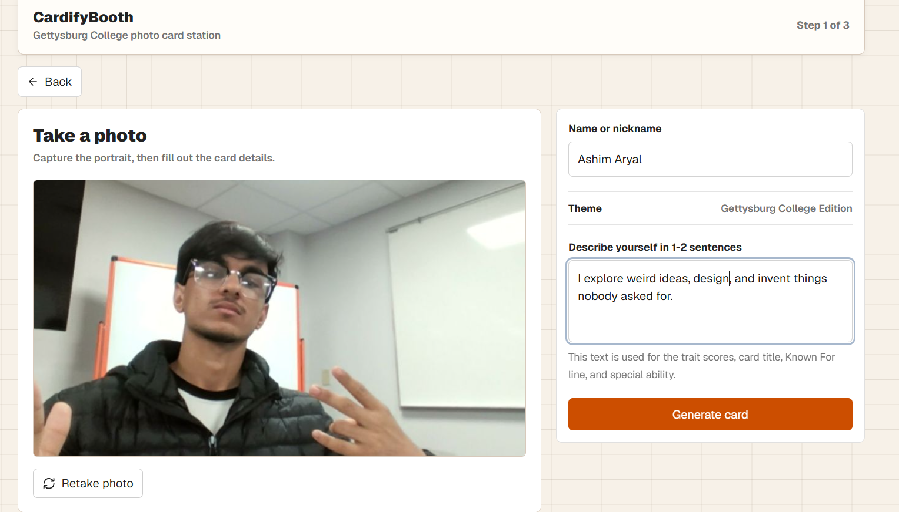
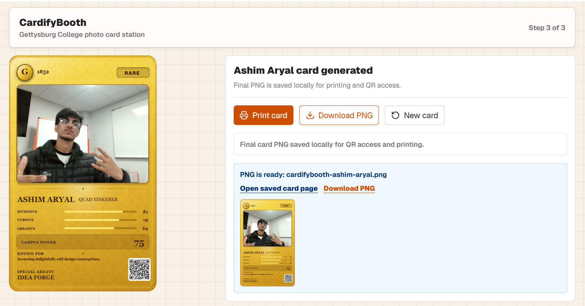

# CardifyBooth

CardifyBooth is a privacy-minded photo booth kiosk for creating Gettysburg College-themed collectible trading cards. The current build uses a camera-first booth flow, classifies a short self-description with an offline multi-label model, renders a print-ready PNG, and stores the final card locally for QR access and printing.

## Demo

**Demo Video:**
[](https://youtu.be/zRU-7PctPQE)

<p align="center">
  
</p>

The booth flow, from capture to print-ready card:

| 1. Capture & describe | 2. Generated card |
| --- | --- |
|  |  |

## Current Features

- Kiosk entry screen with `Card Booth` and reserved `Photo Collage` mode
- Camera-first card capture with sample-photo fallback for testing
- Automatic external-webcam preference, remembered camera selection, mirrored preview, and three-second countdown
- Offline trait classification from a short self-description
- TF-IDF and one-vs-rest logistic regression across 25 possible traits
- Optional OpenAI copywriting for the card title, Known For line, and special ability
- Structured JSON generation with Zod validation
- Fully local card generation when no OpenAI key is configured
- Gettysburg College-themed card renderer with rarity, trait bars, Campus Power, Known For, and Special Ability
- Local PNG storage in `.booth-storage/cards`
- Local SQLite metadata storage in `.booth-storage/cardifybooth.db`
- Bounded local cache that keeps the newest 100 cards and removes the oldest PNG and metadata together
- QR-friendly saved-card page at `/local-cards/[id]`
- Print button stub for the future physical print queue

## Stack

- Next.js App Router
- React and TypeScript
- Tailwind CSS
- OpenAI Responses API
- Python, scikit-learn, and logistic regression for model training
- Pure TypeScript inference for offline kiosk operation
- SQLite with `better-sqlite3`
- Zod
- `html-to-image`
- `qrcode`

## Local Setup

```bash
npm install
npm run dev
```

Open [http://localhost:3000](http://localhost:3000).

Create `.env.local` from `.env.example`:

```env
OPENAI_API_KEY=
OPENAI_MODEL=gpt-5-mini
```

The app still works without `OPENAI_API_KEY`; it uses the local fallback generator.

## Trait Classifier

The trait classifier is always responsible for selecting and scoring the three
card traits. OpenAI, when configured, writes only the supporting card copy; it
does not replace the local model's traits or scores.

```txt
self-description
-> TF-IDF word and two-word features
-> 25 one-vs-rest logistic regression classifiers
-> rank all trait probabilities
-> keep the top three
-> convert confidence and rank into 60-99 card alignment scores
```

The current model was trained on an authored bootstrap corpus with separate
held-out wording. See [`ml/README.md`](ml/README.md) for training commands,
evaluation, dataset limitations, and the path toward a production dataset.

## Local Storage

Generated cards are stored locally on the booth computer:

```txt
.booth-storage/
  cardifybooth.db
  cards/
    {cardId}.png
```

The PNG file is the actual final card image. SQLite stores the metadata that points to that PNG, including display name, rarity, trait scores, Campus Power, print status, creation time, and expiration time.

The booth retains at most 100 card records. After a new card is saved successfully, the oldest PNG and its matching SQLite row are removed when the cache is over that limit.

## Card Flow

```txt
Card Booth
-> capture photo
-> enter name and self-description
-> generate card identity
-> render final card PNG
-> save PNG locally
-> insert SQLite metadata row
-> QR points to /local-cards/{cardId}
```

## Important Files

- `src/components/BoothApp.tsx`: main kiosk flow
- `src/components/ImageUpload.tsx`: camera capture and sample input
- `src/components/CardForm.tsx`: name and self-description form
- `src/components/CardPreview.tsx`: card renderer
- `src/components/CardReveal.tsx`: final reveal, PNG export, local autosave
- `src/app/api/generate-card/route.ts`: card generation API
- `src/app/api/local-cards/route.ts`: local PNG and metadata save API
- `src/app/api/local-cards/[id]/image/route.ts`: local saved PNG image endpoint
- `src/app/local-cards/[id]/page.tsx`: QR destination page
- `src/lib/card-generation.ts`: OpenAI prompt, structured output, validation, fallback
- `src/lib/local-trait-classifier.ts`: offline TypeScript model inference
- `src/generated/trait-classifier.json`: exported model vocabulary and coefficients
- `ml/train.py`: dataset construction, training, evaluation, and model export
- `ml/metrics.json`: latest held-out model evaluation
- `src/lib/local-card-storage.ts`: saves PNG file and creates metadata record
- `src/lib/local-card-db.ts`: SQLite table, insert, and fetch helpers

## Privacy Note

The final card PNG and card metadata are saved locally. Trait classification
always runs locally. When `OPENAI_API_KEY` is configured, the self-description
is also sent to OpenAI only to write the title, Known For line, and special
ability. Leave the key unset for fully offline operation.
